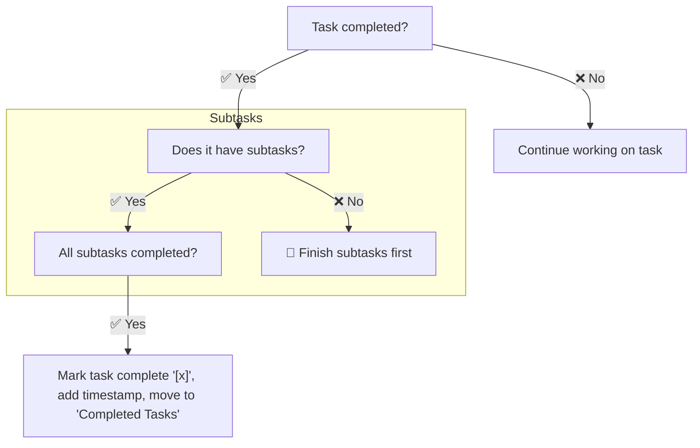

# Creating and Managing Task Plans

## Critical Instructions

1. ✅ ALWAYS use the [template](#task-plan-template) when creating a new task plan
2. ✅ ALWAYS add the new task plan to `./agent/tasks.md` in the appropriate section with a link to the task plan file
3. ✅ ALWAYS update the task plan as you complete tasks
4. ✅ ALWAYS keep the task plan up to date with the latest progress

## Task Management Flow

### Task Completion

## Task Plan Template

<template>

## Context

- **Goal**: [Clear statement of what this plan aims to accomplish
- **Definition of Done**: [What success looks like when implemented]
- **Project doc** (if available): [./agent/projects/project-doc.md]
- **Supporting docs** (if needed):
  - [Supporting doc 1]
  - [Supporting doc 2]
  - ...

## Task Plan

### In Progress

- [ ] Task plan added to `./agent/tasks.md` under appropriate section
- [ ] [First Task]
  - [ ] [Subtask 1 of First Task]
  - [Other subtasks]

### Next Tasks

- [Remaining tasks]

### Completed Tasks

...

### Cleanup?

- [ ] Docs written (if applicable)
- [ ] Tests written (if applicable)
- [ ] Tests passed (if applicable)
- [ ] Changes checked in to appropriate branch (if applicable)

## Follow-up Notes

### Decisions Made

- [Decision 1]
- [Decision 2]
- ...

### Findings

- [Finding 1]
- [Finding 2]
- ...

### Proposed Next Steps

- [Next step 1]
- [Next step 2]
  - ...

</template>