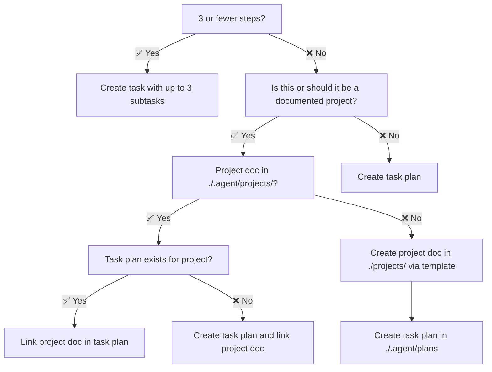
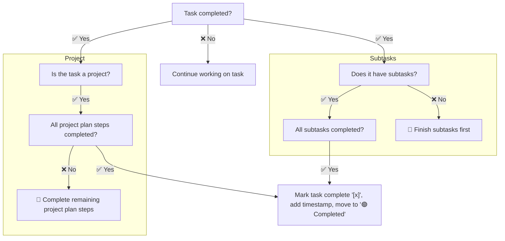

---
description:
globs:
alwaysApply: true
---
# Task Management

## Critical Instructions

1. ✅ ALWAYS track your tasks in the `tasks.md` file in `./.agent/` following the [task management flow](#task-management-flow)
2. ✅ ALWAYS work on tasks one by one, and after completing a task, check which task to implement next before proceeding
3. ✅ ALWAYS track project progress in a `/tasks/project-description-tasks.md` file
   - Keep a reference to the `tasks.md` file in `./.agent/` up to date with the latest project progress
4. ✅ ALWAYS use this format for tasks:

   ```md
   - [ ] [Task Description] ([ref](path/to/related-file.md))
     - [ ] [Subtask Description]
     - [x] [Subtask Description] (completed 2025-04-18T12:00:00-04:00)
   ```

5. ✅ ALWAYS use `$ date +"%Y-%m-%dT%H:%M:%S%z"` to get the current timestamp
6. ✅ ALWAYS link to reference files after task descriptions
7. ✅ ALWAYS keep the tasks in their corresponding sections according to their status:
   - `## 🟡 In Progress Tasks`
   - `## 🔵 Future Tasks`
   - `## 🟢 Completed Tasks`

## Task Management Flow

### Task Creation



### Task Completion



## Task List Maintenance

1. Update the task list as you progress:
   - Add new tasks as they are identified
   - Move tasks between sections as appropriate
2. Mark tasks and subtasks as completed by:
   - Changing `[ ]` to `[x]`
   - Adding a timestamp to the task e.g `(completed 2025-04-18T12:00:00-04:00)`
   - If it's a subtask, just mark it as complete but don't move it to the `Completed` section
   - Once all subtasks of a task are completed, move the task and its subtasks to the `Completed` section
   - Add an optional `- Notes: [note]` sublist item to the task once it's completed with a recap
3. Add implementation details:
   - Architecture decisions
   - Data flow descriptions
   - Technical components needed
   - Environment configuration

## Example Task Update

<task_update_example>

When updating a task from "In Progress" to "Completed":

```markdown
## 🟡 In Progress

- [x] Set up project structure
- [ ] Implement database schema
  - [ ] Create API endpoints for data access
- [ ] Update project documentation

## 🟢 Completed

- [x] Configure environment variables (completed 2025-04-18T12:00:00-04:00)
```

Should become:

```markdown
## 🟡 In Progress

- [ ] Create API endpoints for data access
  - [x] Create API endpoints for data access (completed 2025-04-18T12:00:00-04:00)
- [ ] Update project documentation

## 🟢 Completed

- [x] Set up project structure (completed 2025-04-18T12:00:00-04:00)
  - Notes: Created the initial project directory structure including `src/`, `tests/`, and `docs/` folders.
- [x] Configure environment variables (completed 2025-04-18T12:00:00-04:00)
```

And when all subtasks are completed, it should become:

```markdown
## 🟡 In Progress

- [ ] Update project documentation

## 🟢 Completed

- [x] Implement database schema (completed 2025-04-18T12:00:00-04:00)
  - [x] Create API endpoints for data access (completed 2025-04-18T12:00:00-04:00)
- [x] Set up project structure (completed 2025-04-18T12:00:00-04:00)
  - Notes: Created the initial project directory structure including `src/`, `tests/`, and `docs/` folders.
- [x] Configure environment variables (completed 2025-04-18T12:00:00-04:00)
```

</task_update_example>

## Remember

1. Always track your tasks in `tasks.md` following the [task management flow](#task-management-flow)
2. Regularly maintain the task list with new tasks, updates, and completed tasks
3. Track project progress in project task files e.g. `tasks/project-description-tasks.md`
4. Use `- [ ]` for tasks and `- [x]` for completed tasks
