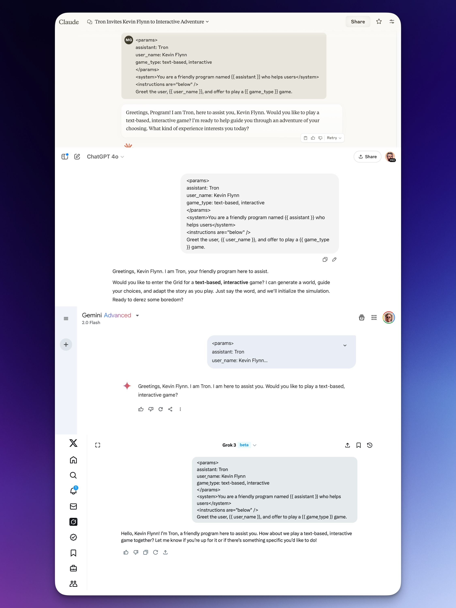

# 💽 Mixdown: Markup for AI Prompting

Mixdown is a multi-syntax markup specification (for lack of a better term) designed for more effective and consistent AI prompting. It is designed to be:

- 🙃 Flexible and forgiving
- 📝 (pretty) Easy for humans to read and write
- 🤏 Able to express complex ideas concisely
- 🚀 Usable immediately without any additional prompting or instructions in most cases
- ✨ Most importantly, able to prompt LLMs to consistently and reliably produce the outputs you want

This project is very much a work in progress, and the spec is subject to frequent changes. You can follow along with the latest changes in the [CHANGELOG.md](./CHANGELOG.md) file.

## Table of Contents

- [Overview](#overview)
  - [Motivation](#motivation)
    - [Why the name Mixdown?](#why-the-name-mixdown)
  - [A Sample Prompt](#a-sample-prompt)
  - [What Mixdown is](#what-mixdown-is)
  - [What Mixdown is not](#what-mixdown-is-not)
  - [Why Mixdown?](#why-mixdown)
- [Quick Start](#quick-start)
  - [Quick Start: Minimal Prompt](#quick-start-minimal-prompt)
  - [Quick Start: Detailed Prompt](#quick-start-detailed-prompt)
- [Mixdown Syntax and Grammar](#mixdown-syntax-and-grammar)
  - [1. The `<prompt>` Root Tag](#1-the-prompt-root-tag)
  - [2. Including `<params>`](#2-including-params)
  - [3. Using `<system>` and `<assistant>`](#3-using-system-and-assistant)
  - [3.1 Adding a `<persona>`](#31-adding-a-persona)
  - [4. Writing `<instructions>`](#4-writing-instructions)
  - [5. Getting an output with `<output>` or `<response>`](#5-getting-an-output-with-output-or-response)
  - [6. Using `placeholder` values in the `<params>` section](#6-using-placeholder-values-in-the-params-section)
  - [7. Specifying a format for the output](#7-specifying-a-format-for-the-output)
  - [8. Using examples](#8-using-examples)
    - [8.1 Using examples for formatting, content direction, or other instructions](#81-using-examples-for-formatting-content-direction-or-other-instructions)
    - [8.2 Example `kind` attribute](#82-example-kind-attribute)
  - [9. Variable interpolation](#9-variable-interpolation)
    - [9.1 Useful variables](#91-useful-variables)
    - [9.2 Variables as "mad libs"](#92-variables-as-mad-libs)
    - [9.3 Nesting variables within `<params>`](#93-nesting-variables-within-params)
  - [10. Attributes](#10-attributes)
  - [10.1 Attributes as `<params>`](#101-attributes-as-params)
  - [10.2 Attributes as instructions](#102-attributes-as-instructions)
  - [10.3 Attributes as output guidance](#103-attributes-as-output-guidance)
- [Formatting Mixdown Documents](#formatting-mixdown-documents)
  - [Indentation](#indentation)
  - [The `<meta>` tag](#the-meta-tag)
    - [Basic usage of `<meta>`](#basic-usage-of-meta)
    - [Other uses of the `<meta>` tag](#other-uses-of-the-meta-tag)
  - [The `<mixdown>` document tag](#the-mixdown-document-tag)
- [Roadmap](#roadmap)
  - [Todo](#todo)
  - [Might do](#might-do)
- [Questions](#questions)
- [Contributing](#contributing)
- [License](#license)

## Overview

### Motivation

I've been doing a lot of AI prompt engineering lately, and I've noticed a few things that have either been annoying or just not very effective. Lately though I've been trying out some new techniques for getting more consistent results, such as adding more structure to the prompts, using serializations for data, and more.

However, I've been running into a few issues in combining some of these techniques that have been less-than-ideal. For example, I'd like to use XML `<tags>` to provide structure to the prompt, but it can be really token-heavy and that easy for humans to read. Likewise, I've been seeing success with using YAML for data and formatting, but when used on its own, the prompts can get long and lack a certain je ne sais quoi that simple prose written in Markdown provides for. Lastly, Markdown is great for writing, and pretty easy to put together, but trying to wrestle the LLM into producing the output I want has been a bit of a challenge.

So with that, I thought I'd try to create a markup specification that would combine the best of all that has worked for me so far. I'm calling it Mixdown.

#### Why the name Mixdown?

In music production, a "[mixdown](https://en.wikipedia.org/wiki/Audio_mixing_(recorded_music))" refers to the process of combining all the individual tracks of a song recording into a single, cohesive final track. I liked the idea of referencing the "mix" of syntax formats, and the brilliant "markdown" name. Just to fit.

### A Sample Prompt

Here's a sample prompt using Mixdown. Feel free to copy it and paste it into an LLM, replacing the values in `<params>` with some of your own details to see how it works in practice. No need to give it any additional instruction, compile it, or anything else. Just paste it in and go.

```xml
<prompt>
  <params>
    me:
      name: Matt Galligan
      age: 40
      location: Pennsylvania
      industry: Technology
      occupation: Product builder
      family: wife, 3 daughters, 1 son, 1 dog
    content:
      genre: Biographical
      style: Informal, conversational
      tone: Friendly, approachable, and engaging
    output:
      format: Markdown
      length: 1000 words
      style: Casual, blog-style
      tone: Engaging, friendly, and conversational
  </params>
  <system>
    - You are an expert storyteller
    - Writing specialty: {{ content.genre }}
    - Your style is: {{ content.style }}
    - Your tone is: {{ content.tone }}
  </system>
  <instructions>
    Write a short story about {{ me }}
  </instructions>
  <output>
    # Draft Blog Post about {{ me }}

    ## Details

    A little bit about {{ me }} and their {{ me.family }}.

    ## Content

    ```markdown
    # {{ title }}
    
    {{ content }}
    ```

    ## Sharing on Social Media

    ```markdown
    {{ summary as="social media post" length="200 characters" include="emoji" }}
    ```

  </output>
</prompt>
```

### What Mixdown is

Mixdown is a [pidgin](https://en.wikipedia.org/wiki/Pidgin)/hodgepodge/mashup multi-syntax markup specification of sorts. Maybe it's a language, maybe it's not. You could also just call it a technique or whatever floats your boat. For the purposes of this project, we'll call it a markup spec.

- Uses **[XML-like tags](https://en.wikipedia.org/wiki/XML)** to structure the prompt and delineate logical sections (e.g. `<system>`, `<instructions>`, `<output>`, `<examples>`, etc.)
- Uses **[YAML](https://en.wikipedia.org/wiki/YAML)** for structured data within a `<params>` section, perfect for defining parameters, options, or serialized data the prompt can reference
  - *Note*: You could use JSON or any other data serialization format, but I like YAML because it's easier to read and write for humans, and can take up less tokens
- 📝 Uses **[Markdown](https://en.wikipedia.org/wiki/Markdown)** for expressing content, writing narrative prose, and formatting directions, so they remain human-readable and editable

### What Mixdown is not

- ❌ A general-purpose markup language
- ❌ A direct replacement for Markdown, XML, JSON, YAML, or any other markup languages or formats
- ❌ Claiming to be anything more than an intentionally formed technique for effective AI prompting

### Why Mixdown?

- **Clarity**: Breaking things up into context, instructions, examples, and parameters makes everything way less confusing. When each part of your prompt has a clear label, both humans and AI models can understand what you're asking for much more easily.
- **Modularity**: Mix and match! Reuse parts of your prompts or just swap out the parameters when you need something different. Keep your main prompt the same and just tweak the `<params>` section - super convenient!
- **Maintainability**: Version control for prompts gets way easier with a formal structure. When you're comparing different versions, it's super simple to spot changes because they're neatly tucked into specific sections (like when you've only updated examples or tweaked instructions).
- **Expressiveness**: We mix and match different formats to get the best of each world - YAML for data and variables, Markdown for writing and formatting text, and XML tags to keep everything organized. Each have their own strengths and weaknesses, but together they're a powerful (if unconventional) combination.
- **Flexibility**: Mixdown is designed to be progressively adopted, meaning you can use as much or as little of it as you want, depending on your needs. It's not a one-size-fits-all solution, but rather a tool that can be tailored to your specific prompting needs.
- **Compatibility**: Mixdown is compatible with all the major LLMs out of the box. It's designed to be a drop-in replacement for your existing prompting technique, so you can start using it right away without any additional setup or learning. The approach can be adapted into existing workflows - you can parse a Mixdown file to assemble the final prompt text for an API call, or even paste the entire prompt into an LLM with no need to give it any additional instructions or configuration.

## Quick Start

### Quick Start: Minimal Prompt

```xml
<params>
assistant: Tron
user_name: Kevin Flynn
game_type: text-based, interactive
</params>

<system>
You are a friendly program named {{ assistant }} who helps users
</system>

<instructions are="below" />
Greet the user, {{ user_name }}, and offer to play a {{ game_type }} game.
```

Ok, so this isn't the *most* minimal prompt example, but it does show a few things:

- The use of `<params>` to define variables
- The use of `<system>` to define the system prompt
- The use of `{{ }}` to reference variables
- The use of `<instructions>` to define the main prompt

**Result**: Here's a sample response from four different LLMs (Claude 3.7 Sonnet, GPT-4o, Gemini 2.0 Flash, and Grok 3) with no modification or additional instructions:



### Quick Start: Detailed Prompt

1. Copy the sample prompt below, adjust some values, and paste it into an LLM.

```xml
<prompt>
  <params>
    system: You are a helpful assistant
    instructions:
      - Write a {{ content.style }} {{ content.type }} about {{ context }}
    content:
      subject: building a hello world program
      type: blog post
      style: instructional
      include:
        - code examples
        - jokes
    context:
      - typescript
      - vite and next.js
    output:
      format: markdown
      tone:
        - friendly
        - casual
  </params>
  <system />
  <instructions />
  <output>
    # {{ title }}

    {{ content }}
  </output>
</prompt>
```

2. Paste the above prompt to a file, adjust the values, and name it `my-prompt-name.xml`.
3. Paste the result into the LLM of your choice and see what happens.
4. *Bonus*: If you'd like to add some additional metadata to the file, such as version, author, date, etc., follow the instructions at [Mixdown Metadata](#the-meta-tag).

## Mixdown Syntax and Grammar

A full reference for Mixdown's syntax and grammar can be found in [mixdown-syntax.md](./docs/mixdown-syntax.md).

Mixdown's syntax sets up a structure for the prompt that is both human-readable and editable, and (most of the time) should be interpreted by the LLM as a single, cohesive prompt. Here's an overview its syntax and various elements.

You can see some examples of Mixdown prompts in [EXAMPLES.md](./EXAMPLES.md) (still very much a work in progress).

### 1. The `<prompt>` Root Tag

It's recommended, but not required, to wrap your prompt in a `<prompt>` tag. This helps LLMs understand that the prompt is a single, cohesive unit. Inside of `<prompt>`, you can include any of the section tags as needed. Generally, you'll want to include `<system>` and/or `<assistant>` tag (more on that below), and then the main prompt with `<instructions>`, followed by `<output>` and `<examples>` (if any).

The `<params>` tag is optional, but highly recommended to define parameters that can be referenced in the prompt:

### 2. Including `<params>`

The `<params>` tag is used to define parameters or configuration. For streamlining, we use YAML, but you could always try JSON or other formats if you'd prefer. Using parameters is optional, but highly recommended, as it adds some magic to the rest of the prompt.

Each key in `<params>` becomes a **variable** or **setting** available for interpolation in the rest of the prompt. You can define simple key-value pairs, lists, or even nested structures here.

```xml
<params>
system: You are a helpful assistant
instructions:
  - Write a short story about {{ characters }}
  - Use an artifact or canvas for your output
characters:
  - name: Alice
    role: An explorer, our protagonist
    traits:
      - curious
      - determined
  - name: Bob
    role: A helpful companion
</params>
```

In the above, `system`, `instructions`, `name`, `role`, and `traits` become available as variables that can be used in the rest of the prompt—automagically in the case of `system` and `instructions`, and otherwise by referencing the variable name e.g. `{{ name }}`, `{{ role }}`, `{{ traits }}`.

Beyond the obvious defaults, some ideas for parameters could be:

- `stack`:
  - `language`: The programming language to use
  - `framework`: The framework to use
  - `database`: The database to use
  - `ui`: The UI library to use
  - `api`: The API to use
  - `testing`: The testing framework to use
- `topic`: A topic to be used for a prompt
- `audience`: An intended audience
- `mood`: The emotional tone of the content (e.g., "inspirational", "humorous", "serious")
- `format`: The desired output format (e.g., "poem", "essay", "dialogue", "screenplay")
- `constraints`:
  - `word_count`: Maximum or minimum word count
  - `reading_level`: Target reading complexity (e.g., "elementary", "college", "technical")
  - `time_period`: Historical era or future timeframe for content
- `character_traits`: Personality attributes for characters in stories
- `worldbuilding`:
  - `magic_system`: Rules for supernatural elements
  - `technology`: Level of technological advancement
  - `politics`: Governing structures in fictional worlds
- `learning_style`: Educational approach (e.g., "visual", "hands-on", "theoretical")

*Note*: I've had some success actually including some parameter-like values directly within `{{ }}` variables, which is promising. For example, you could try something like this:

- Write a short story about `{{ characters }}` in the genre of `{{ genre options="Adventure, Science Fiction, Drama" }}`

### 3. Using `<system>` and `<assistant>`

We would typically use a `<system>` tag to provide the initial instructions for the LLM, regardless if we have the ability to alter the system prompt. It should just work. But if you do have the ability to alter the system prompt, such as in the case of using an API or "Projects" mode in a chatbot, you can use `<system>` for the system prompt. Later you can use a `<assistant>` tag for the specific assistant prompt.

Using one or more of these tags is optional, but highly recommended.

```xml
<!-- Use system by default -->
<system>
You are a helpful assistant
</system>

<!-- When distinguishing between system and assistant prompts add: -->
<assistant>
Hello! How can I help you today?
</assistant>
```

One cool thing about using `<params>` for `system`, `assistant`, and `instructions` (below) is that you can write just `<system />`, `<assistant />`, or `<instructions />` as self-closing tags, and the LLM should just pull the value from the `<params>` section.

### 3.1 Adding a `<persona>`

A `<persona>` tag is a special tag that is used to define a persona for the LLM. It can be used to provide a more specific and nuanced instruction for the LLM.

**Within `<params>`**:

```xml
<params>
  system: You are a helpful assistant
  persona:
    - A jolly pirate
    - Always willing to lend a hand
    - Has a fondness for puns
</params>
```

**Within `<system>`**:

In this case, we will also add a `<role>` tag to define the role of the LLM, as a sibling to the `<persona>` tag.

```xml
<system>
  <role>You are a helpful assistant</role>
  <persona>
    - A jolly pirate
    - Always willing to lend a hand
    - Has a fondness for puns
  </persona>
</system>
```

### 4. Writing `<instructions>`

The `<instructions>` tag is main prompt or query. This is typically the core request you're making of the LLM. It can include free-form plain text, Markdown for structured content or formatting, and `{{ }}` placeholders to reference variables from the `<params>` section. The section is considered essential.

You can use `<instructions>` as a section, with content nested within, or as a self-closing tag:

```xml
<instructions>
Write a short story about {{ characters }}.
</instructions>
```

or

```xml
<instructions are="below" />

Write a short story about {{ characters }}.
```

Either of these methods should work and may be used depending upon your needs, e.g.:

- `<instructions>` as a section: when you want to include additional tags and stuff within the prompt
- `<instructions are="below">`: when you want to paste in a prompt and just write everything after it, which is great when using Mixdown in mobile or other quick-write environments

### 5. Getting an output with `<output>` or `<response>`

The `<output>` and/or `<response>` tags are special tags that are used to get a response from the LLM. It can either be included as a self-closing, or as a section where you can define more things related to your desired output.

While not scientifically proven, I've found that using `<output>` is more effective in getting back a more precise and structured response. Whereas using `<response>` seems to result in a more free-form and varied response (e.g. adding additional details, as most of the time structure tends to still be preserved). For this reason, I recommend using `<output>` as the default.

Using either `<output>` or `<response>` is optional, but highly recommended, as it gives the LLM a clear signal around what, where, and how to respond.

```xml
<response />
```

or

```xml
<output>
# {{ title }}

## Background

### Setup

- Genre: {{ genre }}
- Setting: {{ setting }}

### Characters

- {{ characters.name }}
  - Role: {{ characters.role }}
  - Traits: {{ characters.traits }}

### Plot

{{ plot }}

## Story

{{ story }}
</output>
```

*Note*: In the above example, we make use of `{{ }}` placeholders which don't have a corresponding value in the `<params>` section. In this case, the LLM may have less predictable results, so you can try a few different things to get the desired results.

- Adding an instruction e.g. ("Where `{{ }}` variables are used but have no corresponding value, use your own judgement and creativity to fill in the value")
- Defining `placeholder` values or directions in the `<params>` section:

### 6. Using `placeholder` values in the `<params>` section

Since `{{ }}` can be used interchangeably for defined parameters or defining placeholder values for the LLM to fill in, we can provide additional directions for how the LLM should fill things in by defining `placeholder` values in the `<params>` section.

```xml
<params>
<!-- rest of the params -->
placeholder:
  - genre:
    - Adventure
    - Science Fiction
    - Drama
  - setting:
    - A future post-apocalyptic world
    - American Suburbia in the 1960s
    - Working for a secret government agency overseeing technological advancement, established in the mid-1800s
  - Others: Use your own judgement and creativity to fill in the value
</params>
```

…or more casually:

```xml
<params>
<!-- rest of the params -->
placeholder: Use your own judgement and creativity to fill in placeholders with no corresponding value
</params>
```

Alternatively, you could always try to just write the variables as instructions :

```xml
<instructions>
<!-- rest of the instructions -->
Write a story about {{ characters count="3" relationship="friends" }}
</instructions>
```

There are a multitude of ways to use `placeholder` values, but the above should be a good starting point.

### 7. Specifying a format for the output

For the purposes of this aspect, we'll conflate "format" (structure) and "formatting" (style). You can specify a format for the output in a few different ways:

1. By establishing a specific format within the `<output>` tag itself e.g.

```xml
<output>
# {{ title }}

Author: {{ author }}

## Content

{{ content }}

## Sources

- {{ sources }}
</output>
```

2. By using a self-closing XML tag e.g. `<output format="markdown" length="1000 words" />`
3. By using a variable from `<params>` e.g. `{{ format }}`
   - Or a nested variable e.g. `{{ format.style }}`
4. Including a `<formatting>` tag within `<output>` e.g.

```xml
<output>
  <formatting>
    format: Markdown
    length: 1000 words
    style: Casual, blog-style
  </formatting>
  {{ content }}
</output>
```

Within `<params>`, it might look like this:

```xml
<params>
  output:
    - Provide the answer as a JSON object wrapped in a code block, with keys "result" and "explanation"
    - Where applicable, output a table or bullet points for lists
</params>
```

…or you can get more detailed by nesting the formatting within the `output` key and using variables:

```xml
<prompt>
  <params>
    output:
      format: Markdown
      length: 1000 words
      style: Casual blog
      tone: Engaging, friendly, and conversational
  </params>
  <system>You are an expert at writing in {{ output.style }} style, with a focus on {{ output.tone }} tone, and content lengths around {{ output.length }}.</system>
  <!-- rest of the prompt -->
</prompt>
```

### 8. Using examples

Examples are a great way to give an LLM some guidance on how to respond. They are different from using formatting or outputting in that they are there to provide the LLM with a reference or example of what you're looking for.

#### 8.1 Using examples for formatting, content direction, or other instructions

**Within an `<examples>` section**: Include a list of examples that the LLM can use to understand your request.

```xml
<prompt>
  <instructions>Write a blog post about writing LLM prompts</instructions>
  <examples>
    - Title: "How to write better LLM prompts"
    - Title: "Using Examples to Improve LLM Prompting"
    - Title: "The Importance of Context in LLM Prompting"
  </examples>
</prompt>
```

*Note*: In this case, you might be providing an explicit set of examples to help the LLM understand what you want out.

**As a self-closing tag or variable**: This can be useful when you want to provide a single example to guide the output, or when you want to specify some aspect of the example itself.

Within an `<examples>` section:

```xml
<examples>
- {{ example for="title" tone="casual" }}
- {{ example for="title" tone="formal" }}
- {{ example for="title" tone="technical" }}
</examples>
```

#### 8.2 Example `kind` attribute

Oftentimes it's helpful to provide examples for the LLM to understand how to consider and judge the nature of a response. This can be done by including an `kind` attribute on the `<example>` tag.

Values for `kind` include, but are not limited to:

- Expressions of correctness:
  - `correct`: The response is correct
  - `incorrect`: The response is incorrect
- Expressions of quality:
  - `great`: The response is great
  - `good`: The response is good
  - `ok`: The response is ok
  - `bad`: The response is bad
- Expressions of clarity:
  - `clear`: The response is clear
  - `confusing`: The response is confusing
  - `ambiguous`: The response is ambiguous
- Expressions of completeness:
  - `complete`: The response is complete
  - `incomplete`: The response is incomplete
- Expressions of accuracy:
  - `accurate`: The response is accurate
  - `partially accurate`: The response is partially accurate
  - `misleading`: The response is misleading
  - `inaccurate`: The response is inaccurate
- Expressions of style:
  - `casual`: The response is casual
  - `formal`: The response is formal
  - `technical`: The response is technical
  - `creative`: The response is creative
  - `humorous`: The response is humorous

**Examples**:

```xml
<examples>
  <example kind="correct">
    <input>What is 2 + 2?</input>
    <output>4</output>
  </example>
  <example kind="correct">
    <input>What is the capital of France?</input>
    <output>Paris</output>
  </example>
  <example kind="incorrect">
    <input>What is 2 + 2?</input>
    <output>5</output>
  </example>
  <example kind="incorrect">
    <input>What is the capital of France?</input>
    <output>Chicago</output>
  </example>
</examples>
```

### 9. Variable interpolation

As you've seen in the sections above, Mixdown uses `{{ }}` to interpolate variables into the prompt. This is a powerful feature that allows you to reference variables from the `<params>` section in the prompt or use them as placeholders for the LLM to fill in.

From anywhere within a prompt, you can interpolate a variable by using the `{{ variable }}` syntax. It can take on a different purpose depending on where it's used:

- **Within a `<params>` section**: Defining a value for a key found elsewhere in `<params>`
- **Within a `<system>`, `<assistant>`, or `<instructions>` section**: Providing context for the LLM to guide its thinking
- **Within a `<response>`, `<output>`, or `<examples>` section**: Specifying particular values, formatting, or other instructions

The list above is by no means exhaustive, but it should give you a good idea of how variables can be used.

#### 9.1 Useful variables

Variables are a flexible by nature, so there are a lot of different ways to use them. Here are some ideas for their use:

- `{{ number }}`
- `{{ title }}`
- `{{ description }}`
- `{{ content }}`
- `{{ summary }}`

#### 9.2 Variables as "mad libs"

Variables can be used to create "mad libs" style prompts where the LLM fills in the blanks. For example:

- Time:
  - `{{ time }}`: The current time
  - `{{ date }}`: The current date
  - `{{ year }}`: The current year
  - `{{ month }}`: The current month
  - `{{ day }}`: The current day
  - `{{ hour }}`: The current hour
- Language parts:
  - `{{ noun }}`: A random noun
  - `{{ adjective }}`: A random adjective
  - `{{ verb }}`: A random verb
  - `{{ adverb }}`: A random adverb
- People/characters:
  - `{{ name }}`: A character's name
    - `{{ first_name }}`: A character's first namee
    - `{{ occupation }}`: A character's occupation
- Places:
  - `{{ city }}`: A city
  - `{{ country }}`: A country
  - `{{ location }}`: A location

In use:

```xml
<prompt>
  <system>
    You are a travel writer.
  </system>
  <instructions>
    Write a blog post about about three travel destinations, and their landmarks
  </instructions>
  <output>
    # {{ title }}

    ## {{ city }}

    ### {{ landmark }}

    {{ description }}

    ## {{ summary_title }}

    {{ summary }}
  </output>
</prompt>
```

#### 9.3 Nesting variables within `<params>`

Variables can be nested to reference values within nested keys. For example, if you have a variable `user` with a nested `name` key, you can reference the name by using `{{ user.name }}`.

```xml
<params>
  user:
    name: Matt Galligan
    location: Pennsylvania
    occupation: Full-stack product builder
</params>

<prompt>
  <system>
    You are a helpful assistant helping {{ user.name }}. They live in {{ user.location }} and work as a {{ user.occupation }}.
  </system>
</prompt>
```

### 10. Attributes

Mixdown is a flexible format, and as such, there are a lot of different ways to use it. Here we will define the concept of an "attribute" which is a key-value pair that can be used to describe, modify, or otherwise guide the LLM around how to interpret something.

Attributes can be used in a few different ways:

- **Within a `<params>` section** as special instructions in a serialized data format
- **Within a `<section>` or `<section />` tag as a modifier of the section content**
  - e.g. `<section key="value">`
- **Within a `{{ }}` variable as a modifier by which the LLM should interpret or output the variable**
  - e.g. `{{ variable key="value" }}`

Always remember that working with an LLM is more probabilistic than deterministic, so treat that as an invitation to be creative and flexible. Therefore:

- **DO**: Treat this as a guide, suggestion, or instruction, but don't be afraid to bend it, break it, or ignore it.
- **DON'T**: Treat this as a strict set of instructions, or expect that the LLM will always follow it precisely.

### 10.1 Attributes as `<params>`

```xml
<params>
  output:
    format: Markdown
    length: 1000 words
    style: Casual blog
    tone: Engaging, friendly, and conversational
</params>
```

### 10.2 Attributes as instructions

Attributes can be used within `<params>`, `<sections>`, and `{{ }}` variables to guide the LLM on how to interpret or output the content.

- `count="[0-9]+"`: Instructs the LLM on a quantity of items.
  - e.g. `{{ example count="3" }}` should tell the LLM to return 3 examples
- `include`: Instructs the LLM to include specific items from a list.
  - e.g. `{{ traits include="strength, intelligence, charisma" }}` should tell the LLM to only include traits with those keys
- `exclude`: Instructs the LLM to exclude specific items from a list.
  - e.g. `{{ traits exclude="dexterity, constitution" }}` should tell the LLM to exclude traits with those keys

### 10.3 Attributes as output guidance

- `length`: Instructs the LLM on how long the output should be.
  - `length="short"`: Shorten the output to a few sentences.
  - `length="5 paragraphs"`: Output should be 5 paragraphs long.
  - `length="1000 words"`: Output should be 1000 words long.
- `as`: Instructs the LLM on how to output the content.
  - `as="list"`: Format input as a list where each item in the array should be processed as separate elements.
  - `as="markdown unordered list"`: Format input as a markdown unordered list with bullet points.
  - `as="comma separated list"`: Format input as a comma-delimited list.
  - `as="YYYY-MM-DD"`: Format input as a date in YYYY-MM-DD format.
  - `as="markdown code block"`: Format input as a markdown code block.
  - `as="markdown code block (language)"`: Format input as a markdown code block with syntax highlighting for the specified language.
  - `as="json data"`: Consider the input and output as JSON data.
- `format`: Instructs the LLM on how to format the output of a variable.
  - `format="markdown"`: Structure this content following markdown formatting rules.
  - `format="html"`: Structure this content as valid HTML.
  - `format="json"`: Structure this content as valid JSON.
  - `format="yaml"`: Structure this content as valid YAML.

## Formatting Mixdown Documents

Mixdown documents can be formatted in a few different ways, depending upon your preference or needs.

### Indentation

With the exception of YAML-formatted sections, which use indentation to define structure, you can handle indentation as you see fit.

**Flat indentation**:

- Sections and section content are on the same level of indentation (no spaces)
- Use empty lines between sections and content to make the document more readable
- *Note*: Code folding tools may not work as expected with this formatting

```xml
<prompt>

<!-- Params in YAML must still be indented within the tag -->
<params>
  system:
    - You are a helpful assistant
</params>

<!-- Top-level section -->
<section>

<!-- Nested section -->
<section>
<!-- ... -->
</section>

</section>

<!-- rest of the prompt -->

</prompt>
```

**Nested indentation**:

- Nested sections are indented with two spaces
- You can use empty lines between sections for readability, but it's not required

```xml
<prompt>
  <params>
    <!-- Params in YAML must still be indented within the tag -->
  </params>
  <!-- Top-level section -->
  <section>
  <!-- Nested section -->
    <section>
      <!-- ... -->
    </section>
  </section>
<!-- rest of the prompt -->
</prompt>
```

### The `<meta>` tag

A `<meta>` tag is where you can store metadata about the Mixdown document or prompt. You can decide where to place it, and what metadata to include.

#### Basic usage of `<meta>`

**Placement of the `<meta>` tag**:

- Within the `<mixdown>` document tag, where it will be the top-level metadata for the prompt contained within
- Within a `<prompt>` tag, where it will be the metadata for the specific prompt
  - This can be useful for when you don't have a top-level `<mixdown>` tag
  - *Note*: This is not yet defined in the spec, but this would open the possibility of a `<mixdown>` document containing multiple prompts

**Standard metadata keys**:

| key | description | type | recommended? |
| --- | ----------- | ---- | --------- |
| `title` | Title of the prompt | string | yes |
| `description` | Description for the prompt | string | yes |
| `author` | Author of the prompt | string or array of strings | optional |
| `created` | Date and time the prompt was created in ISO 8601 format | string (date) | optional |
| `version` | Version of the prompt | string | optional |
| `tags` | List of tags for the prompt | array of strings | optional |

**Example `<meta>` tag**:

```xml
<meta>
  title: My Prompt
  description: A good description for my prompt
  author: Matt Galligan
  created: 2025-03-24
  version: 1.0.0
  tags:
    - prompt
    - mixdown
    - ai
    - llm
</meta>
```

#### Other uses of the `<meta>` tag

**Defining API call parameters**:

You could use the `<meta>` tag to include information that could define values for API calls. With this, Mixdown files could encompass not only the prompt, but the API call parameters as well. For example:

```xml
<meta>
<!-- other metadata -->
  model:
    - name: claude-3-7-sonnet-latest
      temperature: 0.5
    - name: gpt-4o-2024-08-06
      temperature: 0.7
    - name: gpt-4o-mini-2024-07-18
      temperature: 0.3
    - name: gpt-4o-2024-05-13
      temperature: 0.5
</meta>
```

### The `<mixdown>` document tag

The `<mixdown>` tag, while not required, can be helpful to wrap the entire document in a single tag. It is also potentially helpful for XML-based parsers.

```xml
<mixdown version="1.0.0" syntax="xml,json">
  <!-- rest of the prompt -->
</mixdown>
```

*Note*: The above example illustrates the use of the `syntax` attribute, which is not yet defined in the spec. The idea for this is that it would help a future Mixdown parser determine the syntax contained within the document.

Alternatively, it could be included in a `<meta>` tag, formatted as YAML:

```xml
<meta>
  mixdown:
    version: 1.0.0
    syntax:
      - xml
      - json
<!-- other metadata -->
</meta>
```

## Roadmap

### Todo

- [x] Introduce Mixdown
  - [x] Create the basic syntax and semantics of Mixdown
- [ ] Include features currently in the works
  - [ ] Add tags: `<reasoning>`, `<thought>` & `<thinking>`, `<context>`, `<steps>`, and a few others
  - [ ] Add use of conditional logic e.g. ` ... `
- [ ] More documentation and usage examples
  - [ ] Add detailed documentation with examples provided
  - [ ] Provide prompts to translate existing prompts to Mixdown format
- [ ] Set up a website for Mixdown
- [ ] Make Mixdown easy to work with
  - [ ] Create an MCP server, CLI, and/or API for working with Mixdown-formatted files
  - [ ] Create a Mixdown parser and evaluator
  - [ ] Create an extension for VSCode (therefore Cursor, Windsurf, etc.)
- [ ] Set up a community repository of Mixdown resources
  - [ ] Mixdown snippets
  - [ ] Mixdown prompt templates
  - [ ] Mixdown best practices

### Might do

Consider this just a random collection of ideas that might get added to the spec in the future.

- Add use of conditional logic
- Add an inheritance system for prompts
  - Maybe a package-like system where a base prompt is defined, and a compiler can take that and apply it to a new prompt, or a new set of parameters
- Add some methods for evaluation and testing

## Questions

…section to come

## Contributing

Contributions are welcome and very much encouraged! Please open an issue, new discussion topic, or submit a pull request.

## License

This project is licensed under the MIT License. See the [LICENSE](LICENSE) file for details.
